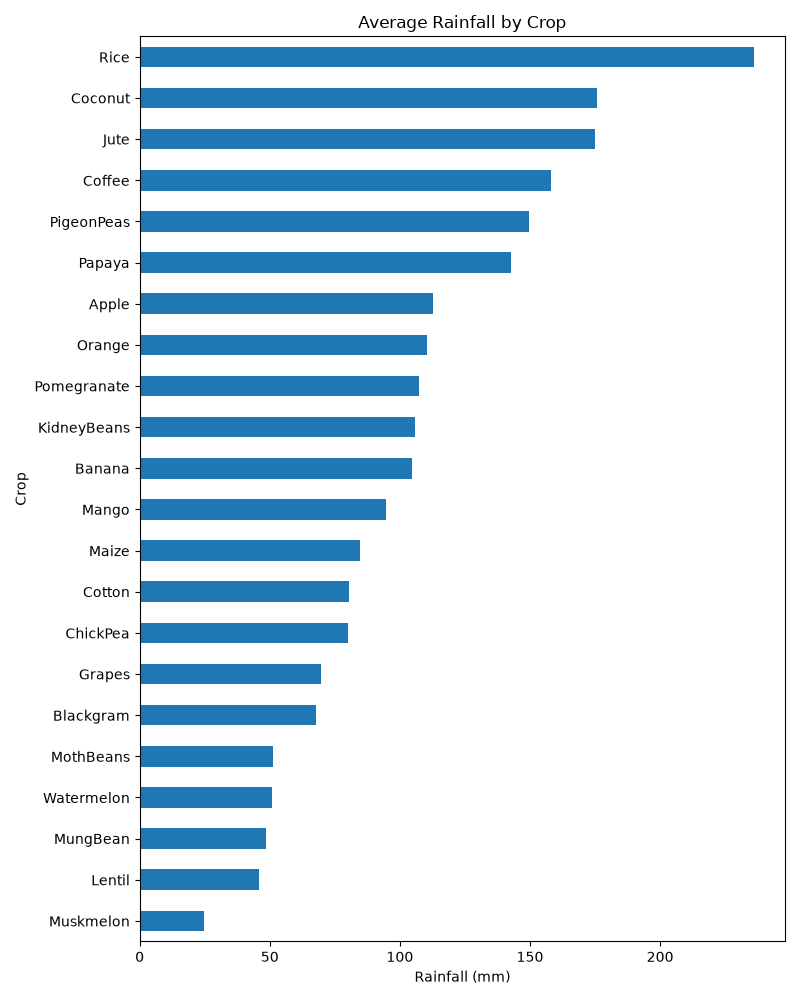
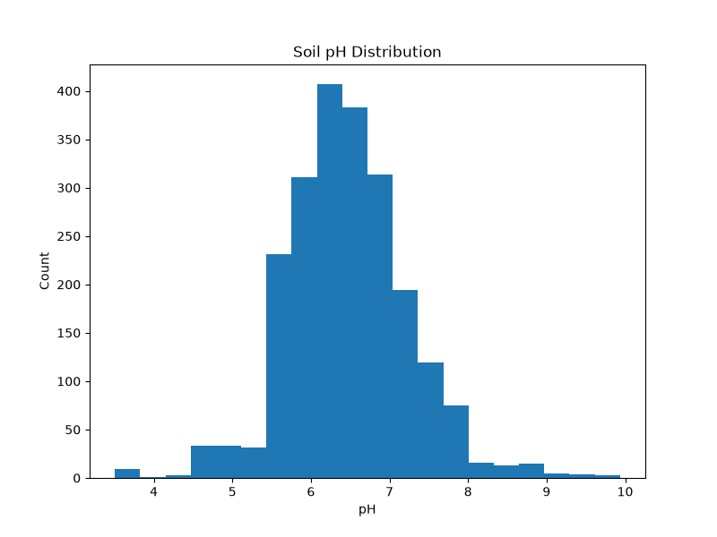
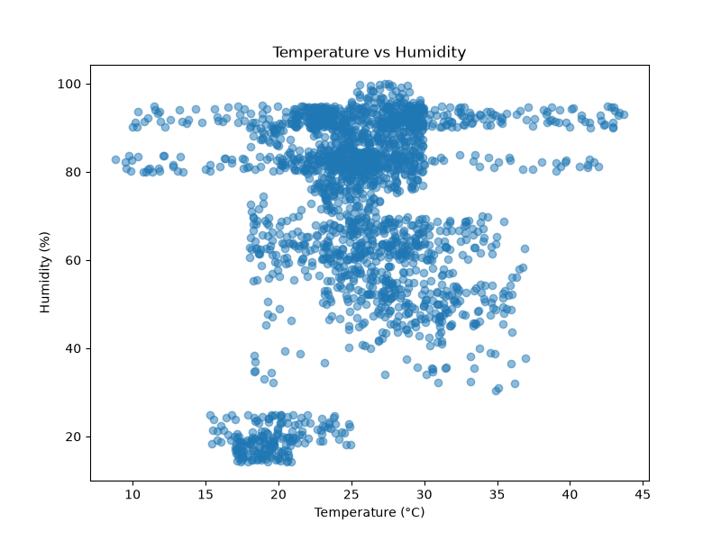

# Crop Data Explorer

A small Python project that cleans and visualizes crop data to see how rainfall, temperature, and soil pH vary across crops.

## Dataset
Crop Recommendation Dataset from Kaggle (2,200 rows: soil nutrients, temperature, humidity, pH, rainfall, crop type).

## What I did
- Cleaned the data with pandas (removed duplicates and missing values)
- Made 3 charts with matplotlib

## Findings
- Rice, coconut, and jute need the most rainfall (roughly 175-235 mm on average), while muskmelon, lentil, and mungbean need the least.
- Soil pH is concentrated between about 6 and 7, with most values between 5.5 and 7.5.
- Temperature vs humidity forms three distinct clusters: high humidity (80-95%) at 22-30°C, medium humidity (35-70%) across a wide temperature range, and a small low-humidity group (15-25%) at cooler temperatures.

## How to run
1. pip install pandas matplotlib
2. Download the dataset from Kaggle and put the CSV in the same folder
3. python explore.py
